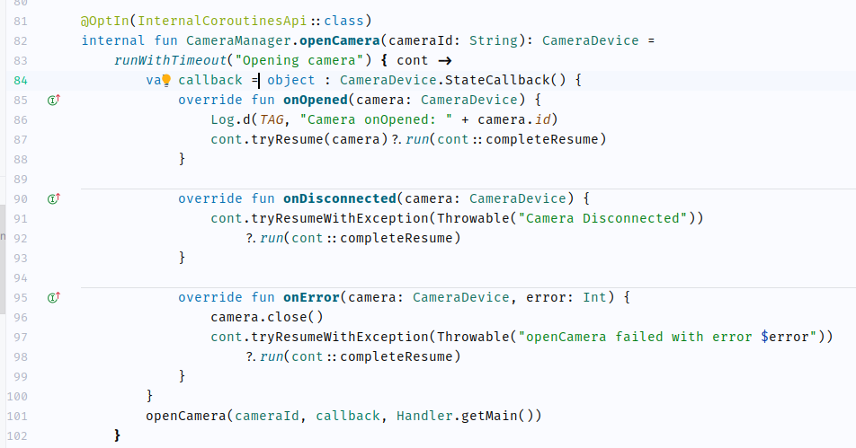

# .vcaen (Vadim's dotfiles)

## What are dotfiles ?

The name _dotfiles_ comes from the concept files whose name is prefixed with a dot `.`. 
Those files are usually hidden in Linux and MacOS, and are used to save configurations for various programs.

If one wants to save the customization they made to those configuration file, it's a good practice to back them up somehere. 
I decided to go the Github route to be able to share them to the world.

## What is special about my dotfiles ?

I've been working on Android at Google for 7 years and my dotfiles reflect the tooling I need to be more productive. 

I usually share them with new teammates when they join the team to help them setup their own workflow. 
But I also insist on them just cherry-picking the tools they need, because utlimiatlty the best workflow for you is 
the one you made for yourself.

## My workflow

To better understand what is in my dotfiles, let me explain the tools I use:

 - **Hardware**
     - I work mainly on a Linux desktop locally or remotly via my Mac.
       
 - **Shell**
     - My Shell is setup to [zsh] with [Oh My Zsh] to improve the experience
     - Most of the time I use [tmux], but few of my scripts are not dependent on it
     - I recently discover [fzf] so I integrate it more and more with my scripts.
     - I don't have a particular prefence for the terminal emulators: kitty, gnome-ternminal, iTerm2 on Mac.

 - **Tools**:
     - I extensively use git and repo (a wrapper made by Google to manage multiple Git repository at the same time).
       You can find a lot of usefule alias in my [.gitconfig](git/gitconfig)
     - My window manager is [i3wm] (made by another Googler ;) )
     - I use IntelliJ/Andorid Studio and VS Code as my main IDE and file editor.
  
  - **Rust tools**
      - I'm not really developpin in rust, but the Rust package manager provides some really cool tool that I use daily:
        [bat], [ag] (aka. `The Silver Searcher`), [fd-find].
  
  ## Color Schemes

   - [Intellij dark theme](Vadim%20Scheme.icls)

     

   - [Intellij light theme](Vadim_light.icls) (for when it's sunny  outside or I need to wake up)

     

[fzf]: https://github.com/junegunn/fzf
[i3wm]: https://i3wm.org/
[tmux]: https://github.com/tmux/tmux/wiki
[zsh]: https://wiki.archlinux.org/title/zsh
[Oh My Zsh]: ohmyz.sh
[bat]: https://github.com/sharkdp/bat
[ag]: https://github.com/ggreer/the_silver_searcher
[fd-find]: https://github.com/sharkdp/fd
